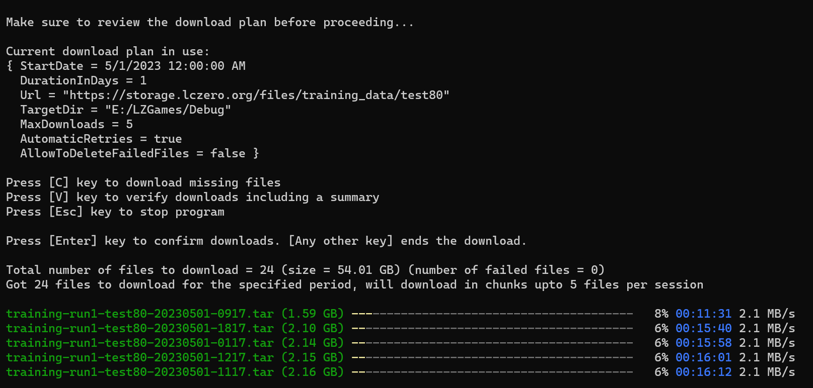

# LZTraining - A simple cross platform solution for downloading training data from Leela Chess Zero
Download training data from Leela Chess Zero with ease. This console-based application is designed for downloading training data from storage.lczero.org and runs on Windows, Mac, and Linux operating systems. 
It will automatically download the training data and save it to a specified directory on your computer. It also supports automatic retries and verification of downloaded files.

Screenshot of the program running:




Configure your download plan by defining the various settings needed for downloading the training data. The configuration/download plan is defined in a json-file like this:
```
{
  "StartDate": "2023-05-01",
  "DurationInDays": 1,
  "Url": "https://storage.lczero.org/files/training_data/test80",
  "TargetDir": "E:/LZGames/T80",
  "MaxDownloads": 5,
  "AutomaticRetries": true,
  "AllowToDeleteFailedFiles": false
}
```
- StartDate: The start date of the downloads to fetch
- DurationInDays: The duration/period in days for collecting files to download from storage
- Url: The source url of the training data/files to download. This is fixed and should not be changed
- TargetDir: The destination directory where the files are saved
- MaxDownloads: The maximum number of concurrent downloads per session. 10 is the current limit
- AutomaticRetries: Whether to retry failed downloads automatically
- AllowToDeleteFailedFiles: Whether to delete partially downloaded or invalid files


The configuration plan is used by the application to define the above settings. Once the configuration plan is set up, it can be used to download the training data. 


To run the program, you will need to have .NET 7.0 or later installed. You can download it from the official .NET website. 

Once you have installed .NET, build the project and navigate to the project directory containing the Program.fs file in your terminal and run the command dotnet run. If you want to use a custom configuration plan, you can you can pass the path to a json-file as an argument like this:

` dotnet run C:\path\to\config.json `

Alternatively, you can just download the pre-built binaries in the release page for Windows, Mac and Linux. To run the pre-built binaries:

Open a command prompt or terminal and navigate to the folder where the file is located.
Before running the program, make sure that you open the configuration file (downloadplan.json) to specify your own download plan and save your changes.
You are now ready to run the file - you can run the program directly from the command prompt or by double-clicking it. 
To run it with a custom configuration file just pass the path to the file as an argument like this:

` LZTrainingGamesDownloader C:\path\to\config.json `

The application will start and display some output on the console. You can stop/cancel the application anytime by pressing Ctrl+C.

After running the program, there are currently three options: downloading missing files by pressing the 'C' key, verifying downloaded files by pressing the 'V' key and stopping the program by pressing the 'Esc' key.
If no arguments are provided upon running the program, then it uses the default configuration plan. If an argument is passed to the program, it is treated as a path to a JSON file containing a custom configuration plan. Upon verifying the downloaded files, there is either a message confirming the successful downloads or a summary of errors that occurred during the download. The program ends after the 'Esc' key is pressed.


